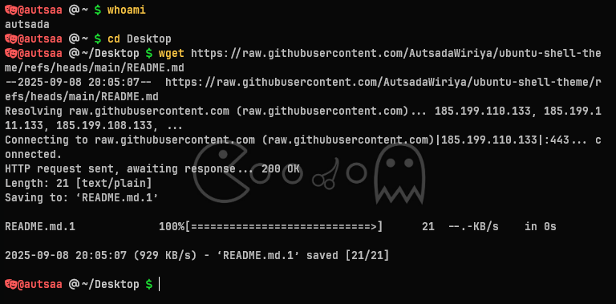

# 🚀 ติดตั้ง Oh My Posh + Zsh + Oh My Zsh



## วิธีติดตั้งทั้งหมด

### 1. ติดตั้ง Oh My Posh
```
curl -s https://ohmyposh.dev/install.sh | bash -s
```

### 2. โหลด Theme (theme.omp.json)
```bash
cd ~/.cache/oh-my-posh/themes

wget https://raw.githubusercontent.com/AutsadaWiriya/ubuntu-shell-theme/refs/heads/main/theme.omp.json
```

### 3. ติดตั้ง Zsh
```bash
sudo apt install zsh git -y
chsh -s $(which zsh)   # ตั้งค่า zsh เป็น shell หลัก
```

### 4. ติดตั้ง Oh My Zsh
```bash
sh -c "$(curl -fsSL https://raw.github.com/ohmyzsh/ohmyzsh/master/tools/install.sh)"
```

### 5. เพิ่ม Plugins
```bash
git clone https://github.com/zsh-users/zsh-syntax-highlighting.git ${ZSH_CUSTOM:-~/.oh-my-zsh/custom}/plugins/zsh-syntax-highlighting
git clone https://github.com/zsh-users/zsh-autosuggestions.git ${ZSH_CUSTOM:-~/.oh-my-zsh/custom}/plugins/zsh-autosuggestions
```

### 6. แก้ไข .zshrc
```bash
nano ~/.zshrc
# เปลี่ยนบรรทัด:
plugins=(git)
# เป็น:
plugins=(git zsh-syntax-highlighting zsh-autosuggestions)
# แล้วเพิ่มบรรทัด:
eval "$(oh-my-posh init zsh --config ~/.cache/oh-my-posh/themes/theme.omp.json)"
ZSH_HIGHLIGHT_STYLES[alias]=fg=11
ZSH_HIGHLIGHT_STYLES[builtin]=fg=11
ZSH_HIGHLIGHT_STYLES[function]=fg=11
ZSH_HIGHLIGHT_STYLES[command]=fg=11
ZSH_HIGHLIGHT_STYLES[path]=none
ZSH_HIGHLIGHT_STYLES[path_prefix]=none
ZSH_HIGHLIGHT_STYLES[unknown-token]='none'
ZSH_HIGHLIGHT_STYLES[single-hyphen-option]='fg=8'
ZSH_HIGHLIGHT_STYLES[double-hyphen-option]='fg=8'
ZSH_HIGHLIGHT_STYLES[default]='none'
```

### 7. โหลด config ใหม่
```bash
source ~/.zshrc
```
